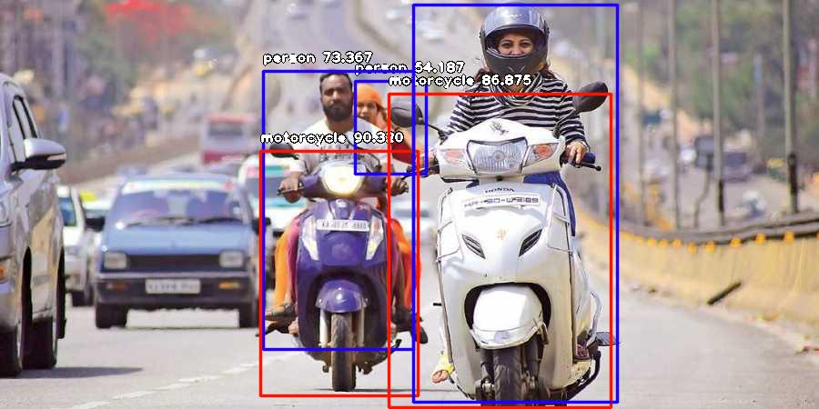

Application for detecting the bike rider is wearing helmet or not if rider is not wearing the helmet the it detect the bike number plate and extract the bike number and save it.  
<h1> Till date work </h1>
"Currently it only detect the bike and rider in the image. After detecting the person it crop the person image from the whole image and save it for the cnn model for classification."
GUI part is complete.
<h1>Input</h1>

<h1> Output <h1>
  
  
  
